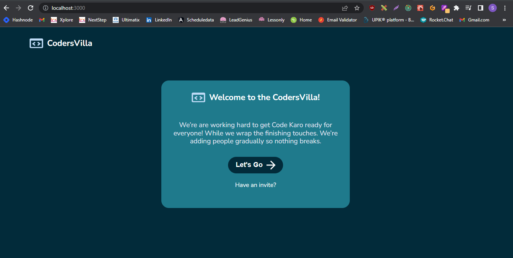
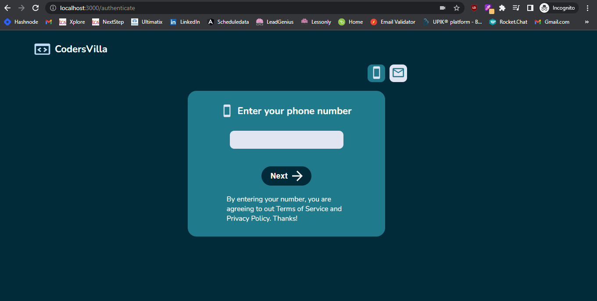
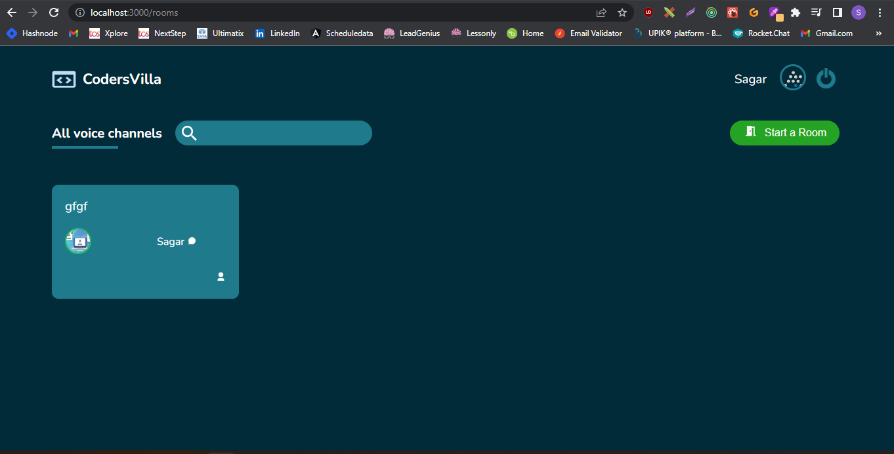
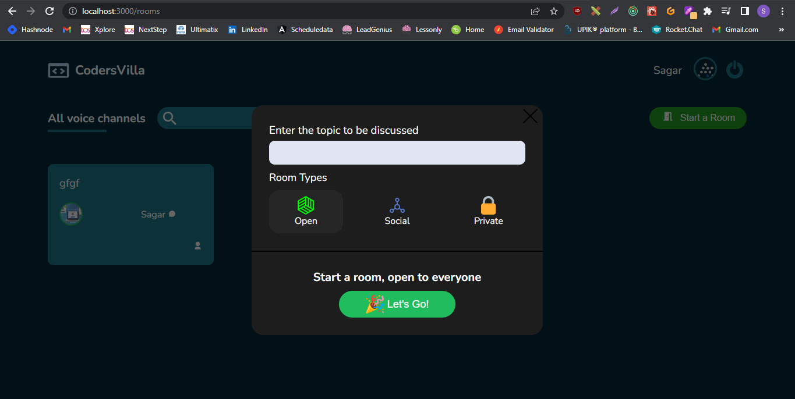

# WebRTC-Voice-Chat-App🚀🚀
-----------------------------------------------------------------------------------
## Stack
- **UI Tool**
  - ✅Figma 
- **Frontend**
  - ✅ReactJS
- **Backend**
  - ✅NodeJS, ExpressJS
- **Database**
  - ✅MongoDB
- **Docker**
- **Heroku**

-----------------------------------------------------------------------------------
Figma Link: https://www.figma.com/file/Euy0P7Xbt7LXbEWrc4RXjT/Realtime-WebRTC-voice-chat-(Community)

-----------------------------------------------------------------------------------
### First Page

### Login Page

### Room Page

### Create-a-Room Page

